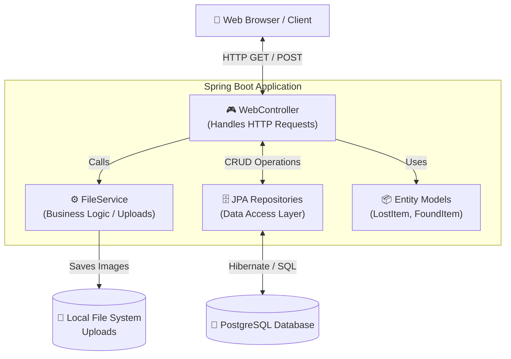
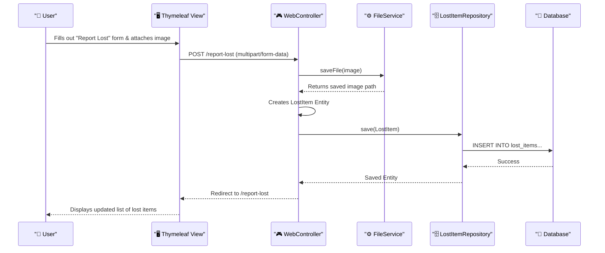

<div align="center">
  <h1>🔍 Lost & Found Management System</h1>
  <p>
    <strong>A modern, full-stack Spring Boot web application to help communities track, report, and recover lost and found items.</strong>
  </p>

  <!-- Badges -->
  <p>
    
    
    
    
  </p>
</div>

<hr />

## ✨ Features

- **📊 Interactive Dashboard**: Real-time statistics of total lost items, found items, and successful matches.
- **📝 Report Lost Items**: Easily submit lost item reports with categories, location tracking, dates, and photo uploads.
- **🕵️ Report Found Items**: Help the community by logging items you've found, including comprehensive descriptions and images.
- **🔍 Advanced Search System**: Filter and search through the entire database by keyword, category, or status (Lost/Found).
- **🎨 Premium UI/UX**: Designed with a sleek, responsive interface featuring modern CSS, glassmorphism, and micro-animations.

---

## 🏗️ System Architecture

The application follows a standard modern, layered **MVC (Model-View-Controller)** architectural pattern.

### 🧩 High-Level Component Diagram



### 🔄 Data Flow: Reporting a Lost Item



---

## 🛠️ Technology Stack

**Backend Framework:**
- Java 17
- Spring Boot 3
- Spring Data JPA (Hibernate)
- Spring MVC

**Frontend:**
- Thymeleaf (Server-side rendering)
- HTML5 / Vanilla CSS3 (Custom Premium Design)

**Database & Infrastructure:**
- PostgreSQL
- Docker & Docker Compose

---

## 🚀 Getting Started (Local Development)

The easiest way to run the application locally is by using **Docker**. This will automatically provision both the Spring Boot web server and the PostgreSQL database.

### Prerequisites
- [Docker & Docker Desktop](https://www.docker.com/products/docker-desktop/) installed and running.

### Installation

1. **Clone the repository**
   ```bash
   git clone https://github.com/Pranav12-karhale/Lost-Found.git
   cd Lost-Found
   ```

2. **Run with Docker Compose**
   ```bash
   docker-compose up --build
   ```

3. **Access the Application**
   Open your browser and navigate to:
   👉 **`http://localhost:8080`**

*(To stop the application, press `Ctrl + C` in the terminal and run `docker-compose down`)*

---

## 📸 Screenshots
*(Add your beautiful screenshots here by dragging and dropping them into the README editor on GitHub!)*

---

## 🤝 Contributing
Contributions, issues, and feature requests are welcome! Feel free to check the [issues page](https://github.com/Pranav12-karhale/Lost-Found/issues).

<div align="center">
  <p>Made with ❤️ by Pranav</p>
</div>
